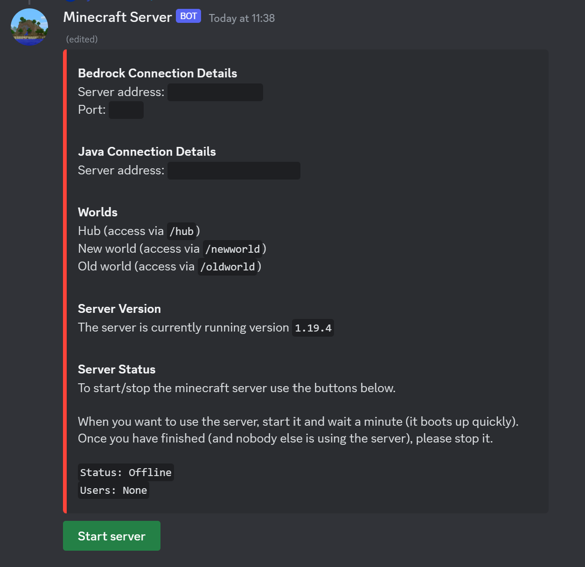

# Minecraft Java and Bedrock Server

This is a fork of [TheRemote/Legendary-Java-Minecraft-Geyser-Floodgate](https://github.com/TheRemote/Legendary-Java-Minecraft-Geyser-Floodgate) with an included discord bot that allows people to start and stop the server at will (the server auto shutsdown after a defined period).

The server uses PaperMC and has preconfigured plugins to allow bedrock people to play and authenticate (using geyser and floodgate).

The discord bot is written in golang (please dont judge my code, its awful because I made it really quickly - I also have no intention to add additional features or 'fix' my bad code because it does its job)

## Screenshot
Please note that the `Worlds` field is custom (its been added using the `ADDITIONAL_MESSAGES_FOR_EMBED` environment variable)


## Environment Variables
For the configuration of environment variables for the discord bot only I recommend using a docker volume. The discord bot loads environment variables from a `.env` file located at `/`
```
/path/to/discordbot.env:/.env
```

### Port
Set port environment variable. Default is `25565`.

### BedrockPort
Set Bedrock port environment variable. Default is `19132`.

### MaxMemory
Optional maximum memory Minecraft is allowed to use

### Version
Optional Paper Minecraft Version override. Default is `1.20.1`.

### TZ
Optional Timezone. Default is `Europe/London`.

### NoBackup=
Optional folder to ignore during backup operations

### BackupCount
Number of rolling backups to keep. Default is 10.

### NoPermCheck
Optional switch to skip permissions check.

### QuietCurl
Optional switch to tell curl to suppress the progress meter which generates much less noise in the logs. Default is true.

### NoViaVersion
Optional switch to disable ViaVersion

### BOT_TOKEN
Discord Bot Token. Needs to be set for discord bot to work.

### APP_ID
Discord Application Id. Needs to be set for discord bot to work.

### GUILD_ID
Guild Id (can be blank but it will take a bit for commands to register globally - this is a limitation of discord).

### OWNER_ID
The person who 'owns' the bot (the only one who can run the command to create the message that allows for starting/stopping server). Needs to be set or nobody can use the bot.

### BEDROCK_ADDRESS
The address for accessing the bedrock minecraft server like mc.example.org. Needs to be set or a the discord bot will look strange.

### BEDROCK_PORT
The port for accessing the bedrock minecraft server. Default is `19132`. This uses a seperate environment variable because the port users connect with might be different to the port within the container.

### JAVA_ADDRESS
The address for accessing the java minecraft server like mc.example.org. Needs to be set or a the discord bot will look strange.

### JAVA_PORT
The port for accessing the java minecraft server. Default is `25565`. This uses a seperate environment variable because the port users connect with might be different to the port within the container.

### MC_VERSION
The minecraft version so the discord bot can display it. Required otherwise bot will look odd.

### LOGS_CHANNEL_ID
The discord channel in which to log who starts/stops the server, leave blank for it to be disabled.

### START_STOP_TIMEOUT_IN_SECONDS
The timeout between starting/stopping the server. Default is `30` seconds.

### AUTOSTOP_TIMEOUT_IN_MINUTES
How long it takes for the server to automatically shutdown once empty. Default is `30` minutes.

### ADDITIONAL_MESSAGES_FOR_EMBED
Additional fields to add to the embed created by the /minecraft command
Format is `Fieldname::Content;;Fieldname::Content` where `::` seperates fieldname from content and `;;` seperates fields
